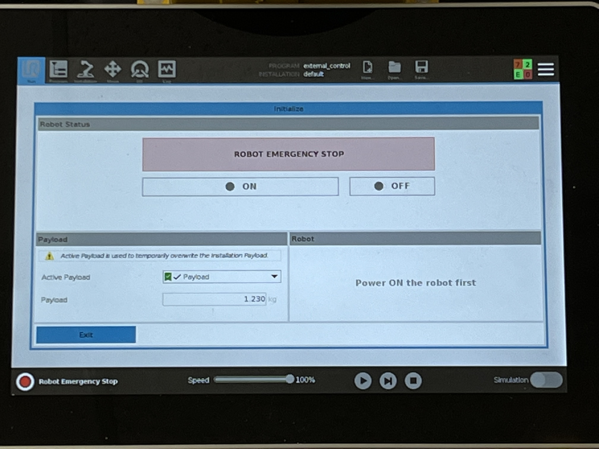

# Start-up Guide

## Turning on the robot
In order for the button to be pressed and have the robot power on the robots key must be plugged in:


## Turning off the robot
Ensure the robot is [E-stopped](https://github.com/DiceLabs/Husky/blob/Clearpath_husky_with_dual_arm_custom_packages/README.md#e-stop), then press & release the power button

## E-STOP
There are two main methods the user can E-stop the robot:

**Pressing the red button on the back of the robot** or **pressing the top right black button on the controller**

## Establishing wireless connection in lab
Connect to **SDSU_Dice_Labs**

Once you have connected into the network try to SSH in to the robot:
```
ssh administrator@146.244.98.51
```
It may ask you some configuration questions simply say **yes** to these
It will prompt you to put in a **password** which is:
```
clearpath
```

If you run into any problem go to [network fixes](https://github.com/DiceLabs/Husky/blob/Clearpath_husky_with_dual_arm_custom_packages/README.md#potential-network-connection-problems--fixes-optional)

## Installing ROS
**Acknowledge** this is for working in **Ubuntu 20.04** environment

These steps can be found on [Ros Noetic Installation](http://wiki.ros.org/noetic/Installation/Ubuntu)

Open a terminal


###### Setup your sources.list
Setup your computer to accept software from packages.ros.org.
```
sudo sh -c 'echo "deb http://packages.ros.org/ros/ubuntu $(lsb_release -sc) main" > /etc/apt/sources.list.d/ros-latest.list'
```

###### Set up your keys
```
sudo apt install curl # if you haven't already installed curl
curl -s https://raw.githubusercontent.com/ros/rosdistro/master/ros.asc | sudo apt-key add -
```
###### Installation
```
sudo apt update
```
```
sudo apt install ros-noetic-desktop-full
```
###### For installing additional packages (format)
```
sudo apt install ros-noetic-PACKAGE
```

###### Ensure installation was successful
```
apt search ros-noetic
```

###### Environment setup
**You must source this script in every bash terminal you use ROS in**
```
source /opt/ros/noetic/setup.bash
```

**If you want every terminal defaulted to sourcing this Ros version**
```
echo "source /opt/ros/noetic/setup.bash" >> ~/.bashrc
source ~/.bashrc
```

**If you are going to be communicating with the ros workspace on the robot (which is almost always) you need to export the robots ros master URI**
```
export ROS_MASTER_URI=http://cpr-a200-0876:11311
```
this is command that is worth [creating an alias](https://github.com/DiceLabs/Husky/blob/Clearpath_husky_with_dual_arm_custom_packages/README.md#useful-bash-aliaseshotkeycommands) for


###### Dependencies for building packages
```
sudo apt install python3-rosdep python3-rosinstall python3-rosinstall-generator python3-wstool build-essential
```
###### Initialize rosdep
```
sudo apt install python3-rosdep
sudo rosdep init
rosdep update
```
## Creating Ros Workspace
Create workspace directories
```
cd
mkdir husky_ws && cd husky_ws
mkdir src && cd src
```
**You need to be on the same wifi network as the robot**
```
scp -r administrator@cpr-a200-0876:~/catkin_ws/src/* .
```
If you run into an error where cpr-a200-0876 can't be found follow the instructions in [network problems section](https://github.com/DiceLabs/Husky/blob/Clearpath_husky_with_dual_arm_custom_packages/README.md#potential-network-connection-problems--fixes-optional) then try again

Install dependencies for these packages that have just been transferred over to device

```
cd ..
rosdep install --from-paths src --ignore-src --rosdistro=$ROS_DISTRO -r -y
catkin_make
source ~/husky_ws/devel/setup.bash
```


### Useful Bash Aliases/Hotkey(commands)
When the process of running common terminal commands gets too repetitive it may be much easier to simplify an entire command to one word or phrase that you can remember. This can be done in the .bashrc script with the following two methods:

**Mehtod 1:**

```
echo "alias husky='ssh administrator@146.244.98.51'" >> ~/.bashrc
source ~/.bashrc
```
**Method 2:**
```
sudo nano ~/.bashrc
```
Then add aliases in the script with this format
```
alias <word_or_phrase_you_want_hotkey_to_be>='<command>'
```
**Example:**
```
alias husky='ssh administrator@146.244.98.51'
```

Save the file and close out of editting window then type this into terminal
```
source ~/.bashrc
```
This will apply all changes made into bashrc

#### Useful aliases
```
alias husky='ssh administrator@146.244.98.51'
alias husky_export='export ROS_MASTER_URI=http://cpr-a200-0876:11311'
alias husky_src='source ~/catkin_ws/devel/setup.bash'
```


## Potential network connection problems & fixes (optional)
The computer or network equipment may be having trouble connecting hostnames to the corresponding ip's

On your personal device
```
sudo nano /etc/hosts
```

Below the line that contatins 127.0.1.1, add this line

```
146.244.98.51   cpr-a200-0876
```

It may be required that you add the connection of ip to hostname of your own device into the robot. If that is the case then you will need to get onto a device that already has an established connection to the robot, SSH into the robot and add your configuration into the robots hosts. This is done below while in a terminal that is with the robots os.

```
sudo nano /etc/hosts
```

Below the line that contatins 127.0.1.1 and other devices that are used in the lab, add a line contataining

```
<your_devices_ip_while_on_SDSU_Dice_Labs_wifi>   <your_devices_hostname>
```

## UR arms

### UI monitor
The robots UI monitor on the back can only operate one arm at a time. To switch from one arm to the other you need to locate the panel under the UI monitor that looks like this and click the **select** button:


Power buttons: Found on the right side of the panel labeled left and right press each to turn on both arms

Light indicators: On the left side there are light indicators also labeled left and right, the red light indicates which arm the UI monitor is currently operating, ignore the green light as it is just excess glow from another indicator light that is unrelated

###### Switching UI from one arm to the other
Select button: The **select** button located under the indicator lights switch the UI monitors operation from one arm to the other.


#### UI Tabs
RUN Tab: Location where programs created on the UI are stored and ran

Program Tab: Where one can use the UI to prgram tasks for the robotic arms to complete

Installation Tab: Where the general settings and configurations of the UI and robotic arms are set and stored

Move Tab: Where one can manually controll the arms movement by either pressing the arrow controls or physically move the robot by hand by pressing the **freedrive** button, then while **holding down** the other **freedrive press & hold** button one can manually push the arm into a desired configuration

I/O Tab: Configure input and output voltage to the system (most likely never need to touch)

Log Tab: See logged info of robotic arms (warnings, e-stops, failures) as will as load print outs on the arm


##### Power on arms
On the robot there are two buttons under the robots UI on the right side of the panel labeled left and right. These are the power buttons. Press and release one of the buttons, then wait until you hear a fan start up, after the fan has started up, you will press and release the other button and it too will have a fan startup. It does not matter what order you press the buttons in. The bootup process will take approx. 2 minutes.

##### Working with UI and controller to activate the arms
Once the arms have powered on the UI on the back of the robot will be on and most likely have a Robot Emergency Stop warning. This is simply stating the last time the robot was in use it was E-stopped. You can just ignore this and click **Not now**

Then you will click the red button on the bottom left corner of the UI 


The UI should now look like this



The Robot Emergency Stop in the red frame indicates that the robot is currently E-stopped. In order to activate and use the arms E-stop must be turned off. There are multiple methods the robot could be in an E-stopped state. The red button on the back panel of the robot could be pressed. To deactivate that button's E-stop, simply twist the button in a clockwise manner until it stops. This will turn off that buttons e-stop, however the robot may still be e-stopped. The robot could also be E-stopped via the controller. In order to release E-stop on the controller you need to press the buton on the controller labeld **GO** if the label has fallen off it is the top left black button. This will cancel out E-stop.

<controller_picture>


Once the robot is no longer in an E-stopped state, the UI should look like this:
<picture_of_ui_before_on>

**Click ON**

Half way through the bootup process of the arm this will come up:

<picture_pos_verfiy>

Take a look at the robot arm and verify that it is in the correct orientation as depicted in the visual model, then proceed to check the box on the left had side stating **I confirm that this shows the real robot pose**

Then **press Robot Position Verified** found on the bottom right side of UI

The UI should now look like this
<Picture_of_UI_halfway_done>

**Press Start**

The UI should look like this with all the process bubbles shown green for a successfull boot up

**You need to do this process for both arms**

Follow back through the steps provided in [Working with UI and controller to activate the arms](https://github.com/DiceLabs/Husky/blob/Clearpath_husky_with_dual_arm_custom_packages/README.md#working-with-ui-and-controller-to-activate-the-arms)


#### Operating the UR arms
Because the UR arms may be ready for operation at a different time than the computer, the drivers are'nt set to launch with startup. In order to launch the drivers you must **SSH into the robots computer** and run this command:

```
roslaunch husky_ur_bringup husky_dual_ur_bringup.launch
```

To know that the driver launched properly you must wait a few seconds, then the grippers of the robot will close and open and these for important lines of termianl printout will be returned:

```
[INFO] [1691691183.451738]: Gripper on port /tmp/ttyRightTool Activated
[INFO] [1691691183.526879]: Robotiq server started
[INFO] [1691691184.385674]: Gripper on port /tmp/ttyLeftTool Activated
[INFO] [1691691184.467960]: Robotiq server started
```


After all the proper signs of a correct driver launch have occured you will then proceed to go to the UI on the robot and **for both arms** click the play button as shown below and then press **Robot Program**
After you have clicked play program on both arms the run tabs as explained in [UI Tabs]() should look like this


After the play robot program has been started on both arms you can now launch the moveit driver that will allow you to control the arms' movements using this command:

```
roslaunch sds04_husky_moveit_config husky_dual_ur_robotiq_2f_85_moveit_planning_execution.launch
```

You can now visualize your robot in RVIZ

## RVIZ

**After following [UR ARM](https://github.com/DiceLabs/Husky/blob/Clearpath_husky_with_dual_arm_custom_packages/README.md#ur-arms) instruction** the robot model is fully ready for the startup of the visualization tool **RVIZ**

### Launching RVIZ
The command to launch Rviz with the live robots model
```
roslaunch husky_viz view_robot.launch
```

**Note**: Make sure the workspace is sourced, the robot master URI is exported in workspace, and robots arms are initialized and communicating with workspace.


<br>
<br>
<br>


